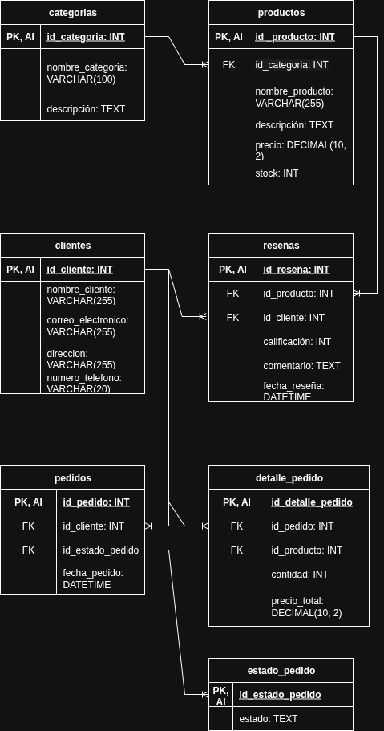

# Proyecto Final – Base de Datos para Tienda Online
**Alumno:** Salinas Mata Luis Antonio  
**Licenciatura:** Tecnologías y Sistemas de Información – UAM Cuajimalpa

---

## 1. Descripción del Problema 
Se nos pide la creación de una tienda online suponiendo que los productos electrónicos necesita un sistema para gestionar sus operaciones incluyendo:
- productos.
- clientes.
- pedidos (con detalles y estado).
- reseñas de productos.
- categorías. 

### Requisitos funcionales:

- **Gestión de Productos:** Nombre, descripción, precio, stock (no negativo), categoría.
- **Gestión de Clientes:** Nombre, correo (único), dirección, número de teléfono.
- **Pedidos:** Fecha, productos incluidos.
- **Reseñas:** Calificación (1–5 estrellas), comentario. Solo por clientes que hayan comprado el producto.
- **Categorías:** Clasificación de productos (ej. teléfonos, laptops, accesorios).
 
Se decidió agregar dos tablas más:

 - **detalle_pedido:** cantidad productos, precio total. 
 - **estado_pedido:** estado (pendiente, enviado, entregado)
   
Estas tablas adicionales permiten cumplir con la **Tercera Forma Normal (3NF)**

### Restricciones clave:

- Máximo 5 pedidos *pendientes* por cliente.
- El stock de productos no debe ser negativo.
- Las reseñas solo pueden ser hechas por clientes que compraron el producto.

### Objetivo General:

Diseñar una **base de datos relacional normalizada**, implementar consultas y al menos **8 procedimientos almacenados**, optimizarla con índices y validarla con datos de prueba.

---

## 2. Requisitos del Proyecto:

- Diseñar una base de datos relacional con al menos 5 tablas (Productos, Clientes, Pedidos, Reseñas, Categorías).

### Entregables: 
- Diagrama Entidad-Relación (ER) que modele entidades y relaciones.
- Esquema en tercera forma normal (3NF), con justificación de normalización.
- Identificación de claves primarias, foráneas y candidatas.

### Análisis para cumplir los criterios de entrega:

Para cumplir con el modelo Entidad-Relación (ER) tenemos que tomar en cuenta lo siguiente:

- **Entidades**: cajas (categoria, productos, clientes, pedidos, detalle_pedido, reseñas, estado_pedido).
- **Atributos**: cada campo de las tablas.
- **Relaciones**: líneas entre entidades.
- **Cardinalidad**: indicación 1:N, N:N, etc.

Ahora para ver que cumpla con la tercera Forma normal (3NF) primero debemos analizar si cumple con la 1NF:

 - LLave primaria en cada una de las tablas
 - No debe haber grupos repetitivos de datos dentro de una misma fila, y todos sus atributos son atómicos. Por ejemplo, un detalle_pedido tiene una cantidad y un "precio_total" especificos para una línea de pedido, no una lista de productos.

Con esto se asegura que cumpla con la "1NF" ahora debemos asegurar que cumpla con las "2NF":

 - Debe estar en "1NF" y todos los atributos no clave deben depender completamente de la clave primaria.

Y por último requisito para que cumpla con la "3NF":

- Debe estar en "2NF" y no debe haber dependencias transitivas. (Una dependencia transitiva ocurre cuando un atributo no clave depende de otro atributo no clave, en lugar de depender directamente de la clave primaria.)

En el diagrama que muestro a continuación se ve claramente que en todas las tablas, cada atributo no clave dependen directamente de la clave primaria de esa tabla, y no de otro atributo no clave dentro de la misma tabla. Por ejemplo, en Productos, nombre, precio, stock dependen directamente de "id_producto", no hay ningún atributo que dependa de nombre en lugar de "id_producto". Así cumpliendo con todos los requisitos del entregable.


## Diagrama base de datos relacional de tienda online


---

## 3. Implementacion de la Base de Datos

Se utilizó **MySQL** como SGBD.

### Entregables:
- Script SQL para crear tablas, claves y restricciones.
- Al menos 3 índices (productos por nombre, por categoría, pedidos por cliente).
- Script SQL para insertar datos de prueba.
  
### Configuración Inicial Generada Automáticamente:
```SQL
SET SQL_MODE = "NO_AUTO_VALUE_ON_ZERO";
```
- Evita que un campo con AUTO_INCREMENT pueda tener valor 0 automáticamente.

Una vez terminadas las configuraciones iniciales empezamos con la creación de las tablas necesarias.

### Tablas:

## Creación de la tabla categorías que incluye lo siguiente:
  - id_categoria: identificador único de categoría.
  - nombre_categoria: aquí se coloca el nombre de la categoría
  - descripcion: aquí se agrega una breve descripción de la categoría. 
```SQL
CREATE TABLE categorias (
  id_categoria int(11) NOT NULL AUTO_INCREMENT,
  nombre_categoria varchar(100) NOT NULL,
  descripcion text NOT NULL,
  PRIMARY KEY (id_categoria)
);
```
## Creación de la tabla  clientes que incluye lo siguiente:
  - id_clientes: identificador único de clientes.
  - nombre_cliente: aquí es donde se coloca el nombre del cliente.
  - correo_electronico: aquí se coloca el correo electrónico del cliente.
  - direccion: aqui se coloca la dirección del cliente.
  - numero_telefono: aquí se coloca el número de teléfono del cliente.  
```SQL
CREATE TABLE clientes (
  id_clientes int(11) NOT NULL AUTO_INCREMENT,
  nombre_cliente varchar(255) NOT NULL,
  correo_electronico varchar(255) NOT NULL UNIQUE,
  direccion varchar(255) NOT NULL,
  numero_telefono varchar(20) NOT NULL,
  PRIMARY KEY (id_clientes)
);
```
## Creación de la tabla “detalle_pedido” incluye lo siguiente:
  - id_detalle_pedido: identificador único de la tabla “detalle_pedido”.
  -  id_pedido: llave foránea enlazada a la tabla "pedidos".
  -  id_producto: llave foranea enlazada a la tabla "productos".
  -  cantidad: aquí se inserta la cantidad productos que hay en el pedido.
  -  precio_total: aquí se inserta el precio final del pedido.
    
NOTA: Esta tabla tiene un enlace a la tabla "pedidos" y "productos" 
```SQL
CREATE TABLE detalle_pedido (
  id_detalle_pedido int(11) NOT NULL AUTO_INCREMENT,
  id_pedido int(11) NOT NULL,
  id_producto int(11) NOT NULL,
  cantidad int(11) NOT NULL,
  precio_total decimal(10,2) NOT NULL,
  PRIMARY KEY (id_detalle_pedido),
  KEY fk_detalle_pedido_pedido (id_pedido),
  KEY fk_detalle_pedido_producto (id_producto),
  CONSTRAINT fk_detalle_pedido_pedido FOREIGN KEY (id_pedido) REFERENCES pedidos (id_pedido) ON UPDATE CASCADE,
  CONSTRAINT fk_detalle_pedido_producto FOREIGN KEY (id_producto) REFERENCES productos (id_producto) ON UPDATE CASCADE
);
```
## Creación de la tabla estado_pedido que incluye lo siguiente:
  - id_estado_pedido: identificador único de la tabla pedido.
  - estado: aquí contendrá el estado del pedido(enviado, cancelado, en proceso).
```SQL
CREATE TABLE estado_pedido (
  id_estado_pedido int(11) NOT NULL AUTO_INCREMENT,
  estado varchar(50) NOT NULL,
  PRIMARY KEY (id_estado_pedido)
);
```
## Creación de la tabla pedidos que incluye lo siguiente:
  - id_pedido: identificador único de la tabla pedidos.
  - id_cliente: llave foránea enlazada a la tabla "clientes".
  - id_estado_pedido: llave foránea enlazada a la tabla "estado_pedido".
  - fecha_pedido: aquí se guardará la fecha del pedido.
```SQL
CREATE TABLE pedidos (
  id_pedido int(11) NOT NULL AUTO_INCREMENT,
  id_cliente int(11) NOT NULL,
  id_estado_pedido int(11) NOT NULL,
  fecha_pedido datetime NOT NULL,
  PRIMARY KEY (id_pedido),
  KEY fk_pedidos_clientes (id_cliente),
  KEY fk_pedidos_estado (id_estado_pedido),
  CONSTRAINT fk_pedidos_clientes FOREIGN KEY (id_cliente) REFERENCES clientes (id_clientes) ON UPDATE CASCADE,
  CONSTRAINT fk_pedidos_estado FOREIGN KEY (id_estado_pedido) REFERENCES estado_pedido (id_estado_pedido) ON UPDATE CASCADE
);
```
## Creación de la tabla productos
  - id_producto: identificador único de la tabla productos.
  - id_categoria: llave foránea enlazada a la tabla "categorias".
  - nombre_producto: aquí se colocará el nombre del producto.
  - descripcion: aquí se colocara una breve descripción del producto.
  - precio: aquí se colocará el precio del producto.
  - stock: aquí se colocará el stock disponible del producto.
```SQL
CREATE TABLE productos (
  id_producto int(11) NOT NULL AUTO_INCREMENT,
  id_categoria int(11) NOT NULL,
  nombre_producto varchar(255) NOT NULL,
  descripcion text NOT NULL,
  precio decimal(10,2) NOT NULL,
  stock int(11) NOT NULL,
  PRIMARY KEY (id_producto),
  KEY fk_productos_categorias (id_categoria),
  CONSTRAINT fk_productos_categorias FOREIGN KEY (id_categoria) REFERENCES categorias (id_categoria) ON UPDATE CASCADE
);
```
## Creación de la tabla resenas
  - id_resena: identificador único de la tabla resena.
  - id_producto: llave foránea enlazada a la tabla "productos".
  - id_cliente: llave foránea enlazada a la tabla "cliente".
  - calificacion: aqui se le colocara la reseña con calificacion del 1 al 5.
  - comentario: aquí se dejará un breve comentario para la reseña.
  - fecha_resena: aquí se colocara la fecha de cuando se realizó la reseña.
```SQL
CREATE TABLE resenas (
  id_resena int(11) NOT NULL AUTO_INCREMENT,
  id_producto int(11) NOT NULL,
  id_cliente int(11) NOT NULL,
  calificacion int(11) NOT NULL,
  comentario text NOT NULL,
  fecha_resena datetime NOT NULL,
  PRIMARY KEY (id_resena),
  KEY fk_resenas_producto (id_producto),
  KEY fk_resenas_cliente (id_cliente),
  CONSTRAINT fk_resenas_producto FOREIGN KEY (id_producto) REFERENCES productos (id_producto) ON UPDATE CASCADE,
  CONSTRAINT fk_resenas_cliente FOREIGN KEY (id_cliente) REFERENCES clientes (id_clientes) ON UPDATE CASCADE
);

```

## Generar datos para poblar las tablas:
A continuacion dejo el script utilizado para poblar las tablas:


```SQL
-- Poblar tabla categorias
INSERT INTO categorias (nombre_categoria, descripcion) VALUES
('Teléfonos', 'Smartphones y móviles de diferentes marcas'),
('Laptops', 'Portátiles para trabajo y entretenimiento'),
('Accesorios', 'Cargadores, fundas, audífonos, etc.');

-- Poblar tabla clientes (15)
INSERT INTO clientes (nombre_cliente, correo_electronico, direccion, numero_telefono) VALUES
('Juan Pérez', 'juan1@gmail.com', 'Av. Reforma 123', '5512345678'),
('Ana Torres', 'ana2@gmail.com', 'Calle Morelos 45', '5512345679'),
('Luis Gómez', 'luis3@gmail.com', 'Insurgentes Sur 33', '5512345680'),
('María López', 'maria4@gmail.com', 'Av. Universidad 99', '5512345681'),
('Carlos Sánchez', 'carlos5@gmail.com', 'Norte 7, CDMX', '5512345682'),
('Fernanda Díaz', 'fernanda6@gmail.com', 'Sur 20, CDMX', '5512345683'),
('Alejandro Ruiz', 'alejandro7@gmail.com', 'Centro, Puebla', '5512345684'),
('Lucía Herrera', 'lucia8@gmail.com', 'Oeste 13, GDL', '5512345685'),
('Miguel Ángel', 'miguel9@gmail.com', 'Zona Centro, QRO', '5512345686'),
('Sofía Medina', 'sofia10@gmail.com', 'Av. Juárez 17', '5512345687'),
('Ricardo Lara', 'ricardo11@gmail.com', 'Calle 5, MTY', '5512345688'),
('Laura Vargas', 'laura12@gmail.com', 'Av. Hidalgo 77', '5512345689'),
('Diego Castro', 'diego13@gmail.com', 'Col. Roma, CDMX', '5512345690'),
('Valeria Ramos', 'valeria14@gmail.com', 'CDMX Sur', '5512345691'),
('Jorge Mendoza', 'jorge15@gmail.com', 'Querétaro Norte', '5512345692');

-- Poblar tabla productos (30)
INSERT INTO productos (id_categoria, nombre_producto, descripcion, precio, stock) VALUES
(1, 'iPhone 13', 'Smartphone de Apple', 17999.00, 25),
(1, 'Samsung Galaxy S21', 'Smartphone Android', 15999.00, 18),
(1, 'Xiaomi Redmi Note 10', 'Gama media Android', 6999.00, 30),
(1, 'Motorola G9', 'Teléfono económico', 4999.00, 50),
(1, 'Huawei P30', 'Smartphone con buena cámara', 10999.00, 10),
(2, 'MacBook Air M1', 'Laptop Apple con chip M1', 23999.00, 15),
(2, 'Dell XPS 13', 'Ultrabook profesional', 18999.00, 12),
(2, 'HP Pavilion', 'Laptop para estudiantes', 13999.00, 20),
(2, 'Lenovo IdeaPad 3', 'Laptop económica', 8999.00, 25),
(2, 'Asus ROG', 'Laptop gamer', 29999.00, 7),
(3, 'Cargador USB-C', 'Carga rápida 20W', 299.00, 100),
(3, 'Funda para iPhone', 'Funda de silicón', 199.00, 80),
(3, 'Audífonos Bluetooth', 'Inalámbricos y compactos', 499.00, 70),
(3, 'Teclado inalámbrico', 'Compatible con todos los SO', 699.00, 30),
(3, 'Mouse gamer', 'Con luces RGB', 599.00, 50),
(1, 'iPhone 12', 'Modelo anterior de Apple', 14999.00, 10),
(2, 'HP Envy', 'Laptop de gama alta', 15999.00, 8),
(2, 'Acer Aspire', 'Laptop básica para casa', 7999.00, 15),
(3, 'Cable HDMI', 'Cable de 2 metros', 199.00, 60),
(3, 'Power Bank 10000mAh', 'Batería externa', 399.00, 40),
(3, 'Soporte para laptop', 'Ergonómico y ajustable', 299.00, 25),
(1, 'Realme C25', 'Smartphone económico', 4499.00, 35),
(1, 'Nokia 5.4', 'Resistente y confiable', 5999.00, 20),
(2, 'Chromebook', 'Para tareas en la nube', 6999.00, 10),
(3, 'Hub USB 4 puertos', 'Expansión USB', 249.00, 90),
(3, 'Lámpara LED escritorio', 'Regulable', 349.00, 60),
(1, 'OnePlus Nord', 'Rendimiento premium', 12999.00, 13),
(2, 'LG Gram', 'Laptop liviana', 17999.00, 5),
(3, 'Audífonos con micrófono', 'Ideales para videollamadas', 399.00, 30),
(3, 'Webcam HD', 'Cámara para streaming', 799.00, 22);

-- Poblar tabla estado_pedido (3 estados)
INSERT INTO estado_pedido (estado) VALUES
('pendiente'), ('enviado'), ('entregado');

-- Poblar tabla pedidos (20)
INSERT INTO pedidos (id_cliente, id_estado_pedido, fecha_pedido) VALUES
(1, 1, '2025-07-01'), (2, 2, '2025-07-02'), (3, 1, '2025-07-03'), (4, 3, '2025-07-04'), (5, 1, '2025-07-05'),
(6, 2, '2025-07-06'), (7, 3, '2025-07-07'), (8, 1, '2025-07-08'), (9, 2, '2025-07-09'), (10, 3, '2025-07-10'),
(11, 1, '2025-07-11'), (12, 2, '2025-07-12'), (13, 3, '2025-07-13'), (14, 1, '2025-07-14'), (15, 2, '2025-07-15'),
(1, 3, '2025-07-16'), (2, 1, '2025-07-17'), (3, 2, '2025-07-18'), (4, 3, '2025-07-19'), (5, 1, '2025-07-20');

-- Poblar tabla detalle_pedido (25)
INSERT INTO detalle_pedido (id_pedido, id_producto, cantidad, precio_total) VALUES
(1, 1, 1, 17999.00), (1, 11, 2, 598.00), (2, 6, 1, 23999.00), (3, 3, 1, 6999.00), (4, 5, 1, 10999.00),
(5, 9, 1, 8999.00), (6, 15, 1, 599.00), (7, 16, 1, 14999.00), (8, 19, 3, 597.00), (9, 25, 1, 249.00),
(10, 28, 1, 12999.00), (11, 29, 1, 17999.00), (12, 30, 2, 798.00), (13, 22, 1, 4499.00), (14, 24, 1, 6999.00),
(15, 21, 1, 299.00), (16, 17, 1, 15999.00), (17, 4, 2, 9998.00), (18, 13, 1, 499.00), (19, 8, 1, 13999.00),
(20, 14, 1, 699.00), (3, 19, 1, 399.00), (6, 26, 2, 25998.00), (10, 27, 1, 17999.00), (12, 23, 1, 5999.00);

-- Poblar tabla resenas (10)
INSERT INTO resenas (id_producto, id_cliente, calificacion, comentario, fecha_resena) VALUES
(1, 1, 5, 'Excelente teléfono, muy rápido.', '2025-07-05'),
(3, 2, 4, 'Buena relación calidad-precio.', '2025-07-06'),
(6, 3, 5, 'La MacBook es muy potente.', '2025-07-07'),
(9, 4, 4, 'Rinde bien para clases.', '2025-07-08'),
(11, 5, 3, 'Cumple con lo necesario.', '2025-07-09'),
(13, 6, 4, 'Cómodos para escuchar música.', '2025-07-10'),
(16, 7, 5, 'iPhone 12 sigue siendo excelente.', '2025-07-11'),
(19, 8, 4, 'Buena batería.', '2025-07-12'),
(22, 9, 5, 'Sorprendido por la calidad.', '2025-07-13'),
(25, 10, 3, 'Funciona bien como USB extra.', '2025-07-14');
```
## Consultas
Se solicito realizar 3 consultas
 - Listar productos disponibles por categoría, ordenados por precio.
 - Mostrar clientes con pedidos pendientes y total de compras.
 - Reporte de los 5 productos con mejor calificación promedio en reseñas.
```SQL
- 1. Listar productos disponibles por categoría, ordenados por precio
SELECT p.nombre_producto, p.precio, p.stock, c.nombre_categoria
FROM productos p
JOIN categorias c ON p.id_categoria = c.id_categoria
WHERE p.stock > 0
ORDER BY c.nombre_categoria, p.precio;

-- 2. Mostrar clientes con pedidos pendientes y total de compras
SELECT cl.id_clientes, cl.nombre_cliente, cl.correo_electronico,
       COUNT(p.id_pedido) AS pedidos_pendientes,
       COALESCE(SUM(dp.cantidad * pr.precio), 0) AS total_compras
FROM clientes cl
JOIN pedidos p ON cl.id_clientes = p.id_cliente
JOIN estado_pedido ep ON p.id_estado_pedido = ep.id_estado_pedido
LEFT JOIN detalle_pedido dp ON p.id_pedido = dp.id_pedido
LEFT JOIN productos pr ON dp.id_producto = pr.id_producto
WHERE ep.estado = 'pendiente' 
GROUP BY cl.id_clientes
ORDER BY cl.id_clientes; 

-- 3. Reporte de los 5 productos con mejor calificación promedio en reseñas
SELECT pr.nombre_producto, AVG(r.calificacion) AS calificacion_promedio
FROM productos pr
JOIN resenas r ON pr.id_producto = r.id_producto
GROUP BY pr.id_producto
ORDER BY calificacion_promedio DESC
LIMIT 5;
```
## Script de Prosedimientos

``` SQL
DELIMITER $$

-- 1. Registrar un nuevo pedido, verificando límite de 5 pedidos pendientes y stock suficiente
CREATE PROCEDURE sp_registrar_pedido(
    IN id_cl INT,
    IN id_prod INT,
    IN cantidad INT,
    IN fecha_ped DATE
)
BEGIN
    DECLARE pedidos_pendientes INT;
    DECLARE stock_actual INT;
    DECLARE nuevo_id_pedido INT;

    SELECT COUNT(*) INTO pedidos_pendientes
    FROM pedidos
    WHERE id_cliente = id_cl AND id_estado_pedido = 1; -- pendiente = 1

    IF pedidos_pendientes >= 5 THEN
        SIGNAL SQLSTATE '45000'
        SET MESSAGE_TEXT = 'El cliente ya tiene 5 pedidos pendientes';
    ELSE
        SELECT stock INTO stock_actual
        FROM productos
        WHERE id_producto = id_prod;

        IF stock_actual < cantidad THEN
            SIGNAL SQLSTATE '45000'
            SET MESSAGE_TEXT = 'No hay suficiente stock para este producto';
        ELSE
            INSERT INTO pedidos (id_cliente, id_estado_pedido, fecha_pedido)
            VALUES (id_cl, 1, fecha_ped);

            SELECT LAST_INSERT_ID() INTO nuevo_id_pedido;

            INSERT INTO detalle_pedido (id_pedido, id_producto, cantidad, precio_total)
            VALUES (
                nuevo_id_pedido,
                id_prod,
                cantidad,
                cantidad * (SELECT precio FROM productos WHERE id_producto = id_prod)
            );

            UPDATE productos SET stock = stock - cantidad WHERE id_producto = id_prod;
        END IF;
    END IF;
END$$

-- 2. Registrar una reseña, verificando que el cliente haya comprado el producto
CREATE PROCEDURE sp_registrar_resena(
    IN id_cl INT,
    IN id_ped INT,
    IN id_prod INT,
    IN calificacion INT,
    IN comentario TEXT,
    IN fecha_res DATE
)
BEGIN
    IF (
        SELECT COUNT(*) 
        FROM pedidos p
        INNER JOIN detalle_pedido dp ON p.id_pedido = dp.id_pedido
        WHERE p.id_pedido = id_ped AND p.id_cliente = id_cl
        AND dp.id_producto = id_prod
    ) = 0 THEN
        SIGNAL SQLSTATE '45000'
        SET MESSAGE_TEXT = 'El cliente no ha comprado este producto';
    ELSE
        INSERT INTO resenas (id_producto, id_cliente, calificacion, comentario, fecha_resena)
        VALUES (id_prod, id_cl, calificacion, comentario, fecha_res);
    END IF;
END$$

-- 3. Actualizar stock de un producto después de venta
CREATE PROCEDURE sp_actualizar_stock (
    IN id_prod INT,
    IN cantidad_vendida INT
)
BEGIN
    IF (
        SELECT stock
        FROM productos
        WHERE id_producto = id_prod 
    ) < cantidad_vendida THEN
        SIGNAL SQLSTATE '45000'
        SET MESSAGE_TEXT = 'Este producto no tiene stock suficiente';
    ELSE
        UPDATE productos
        SET stock = stock - cantidad_vendida
        WHERE id_producto = id_prod;
    END IF;
END$$

-- 4. Cambiar estado de un pedido
CREATE PROCEDURE sp_cambiar_estado(
    IN id_ped INT,
    IN nuevo_estado INT
)
BEGIN
    IF nuevo_estado NOT IN (1, 2, 3) THEN
        SIGNAL SQLSTATE '45000'
        SET MESSAGE_TEXT = 'Estado no existente (1-3)';
    ELSEIF NOT EXISTS (
        SELECT 1 FROM pedidos WHERE id_pedido = id_ped
    ) THEN
        SIGNAL SQLSTATE '45000'
        SET MESSAGE_TEXT = 'El pedido no existe';
    ELSE
        UPDATE pedidos SET id_estado_pedido = nuevo_estado 
        WHERE id_pedido = id_ped;
    END IF;
END$$

-- 5. Eliminar reseñas de un producto específico
CREATE PROCEDURE sp_eliminar_resena(IN id_prod INT)
BEGIN
    IF NOT EXISTS (
        SELECT 1 FROM resenas WHERE id_producto = id_prod
    ) THEN
        SIGNAL SQLSTATE '45000'
        SET MESSAGE_TEXT = 'No hay reseñas de ese producto';
    ELSE
        DELETE FROM resenas WHERE id_producto = id_prod;
    END IF;
END$$

-- 6. Agregar un nuevo producto, verificando duplicado por nombre y categoría
CREATE PROCEDURE sp_agregar_producto(
    IN nombre VARCHAR(255),
    IN descripcion TEXT,
    IN precio DECIMAL(10,2),
    IN stock INT,
    IN id_categoria INT
)
BEGIN
    IF EXISTS (
        SELECT 1 FROM productos WHERE nombre_producto = nombre AND id_categoria = id_categoria
    ) THEN
        SIGNAL SQLSTATE '45000'
        SET MESSAGE_TEXT = 'Ya existe un producto con ese nombre y categoría';
    ELSE
        INSERT INTO productos (nombre_producto, descripcion, precio, stock, id_categoria)
        VALUES (nombre, descripcion, precio, stock, id_categoria);
    END IF;
END$$

-- 7. Actualizar el número de teléfono de un cliente
CREATE PROCEDURE sp_actualizar_telefono_cliente(
    IN id_cl INT,
    IN nuevo_tel VARCHAR(20)
)
BEGIN
    IF NOT EXISTS (
        SELECT 1 FROM clientes WHERE id_clientes = id_cl
    ) THEN
        SIGNAL SQLSTATE '45000'
        SET MESSAGE_TEXT = 'No se encontró al cliente';
    ELSEIF EXISTS (
        SELECT 1 FROM clientes WHERE numero_telefono = nuevo_tel AND id_clientes <> id_cl
    ) THEN
        SIGNAL SQLSTATE '45000'
        SET MESSAGE_TEXT = 'El teléfono ya está registrado por otro cliente';
    ELSE
        UPDATE clientes SET numero_telefono = nuevo_tel
        WHERE id_clientes = id_cl;
    END IF;
END$$

-- 8. Reporte de productos con stock bajo (<=5)
CREATE PROCEDURE sp_reporte_stock()
BEGIN
    SELECT nombre_producto, stock FROM productos
    WHERE stock <= 5
    ORDER BY stock ASC;
END$$

DELIMITER ;

```
 
